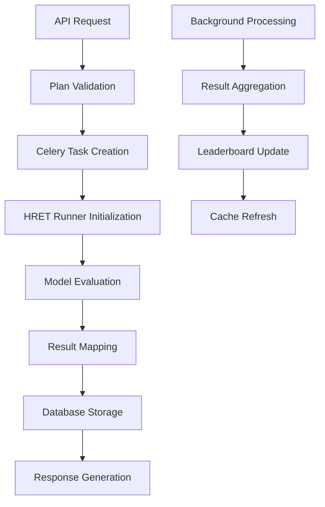

# HRET Integration Guide for BenchhubPlus

## Overview

This document provides a comprehensive guide for the HRET (Haerae Evaluation Toolkit) integration with BenchhubPlus. The integration enables seamless evaluation of Large Language Models (LLMs) using Korean language benchmarks through a unified API interface.

## Table of Contents

1. [Architecture Overview](#architecture-overview)
2. [Installation & Setup](#installation--setup)
3. [API Endpoints](#api-endpoints)
4. [Usage Examples](#usage-examples)
5. [Configuration](#configuration)
6. [Data Flow](#data-flow)
7. [Testing](#testing)
8. [Troubleshooting](#troubleshooting)

## Architecture Overview

The HRET integration consists of several key components:

```
BenchhubPlus
├── apps/backend/routes/hret.py          # HRET API endpoints
├── apps/worker/hret_runner.py           # Core HRET evaluation runner
├── apps/worker/hret_config.py           # Configuration management
├── apps/worker/hret_mapper.py           # Data format mapping
├── apps/worker/hret_storage.py          # Database storage operations
├── apps/worker/tasks.py                 # Celery background tasks
└── apps/core/db.py                      # Database models
```

### Key Features

- ✅ **Full HRET Integration**: Complete integration with HRET evaluation toolkit
- ✅ **RESTful API**: 7 comprehensive API endpoints for evaluation management
- ✅ **Asynchronous Processing**: Background task processing with Celery
- ✅ **Data Persistence**: Automatic storage of evaluation results and leaderboards
- ✅ **Multi-Model Support**: Support for OpenAI, HuggingFace, and LiteLLM backends
- ✅ **Korean Language Focus**: Optimized for Korean language evaluation tasks

## Installation & Setup

### Prerequisites

1. **HRET Toolkit**: Ensure HRET is installed and available
```bash
# Clone HRET repository (if not already done)
git clone https://github.com/HAE-RAE/haerae-evaluation-toolkit.git hret
cd hret
pip install -e .
```

2. **BenchhubPlus Dependencies**: Install required packages
```bash
pip install sqlalchemy pydantic-settings python-jose[cryptography] passlib[bcrypt] celery redis
```

### Database Setup

Initialize the database with HRET-specific tables:

```bash
cd BenchhubPlus
python -c "from apps.core.db import init_db; init_db()"
```

### Configuration

The integration automatically detects HRET availability and configures itself accordingly. No additional configuration is required for basic usage.

## API Endpoints

### 1. Status Check
```http
GET /hret/status
```

**Response:**
```json
{
  "hret_available": true,
  "integration_status": "active",
  "supported_features": [
    "evaluation",
    "plan_validation", 
    "result_storage",
    "leaderboard"
  ]
}
```

### 2. Configuration Information
```http
GET /hret/config
```

**Response:**
```json
{
  "supported_datasets": [
    "benchhub", "kmmlu", "kobest", "klue", "korean_hate_speech",
    "korean_ner", "nsmc", "question_pair", "kornli"
  ],
  "supported_models": [
    "openai", "huggingface", "litellm", "custom"
  ],
  "evaluation_methods": [
    "string_match", "semantic_similarity", "llm_judge", "regex", "custom"
  ],
  "example_plan": "..."
}
```

### 3. Plan Validation
```http
POST /hret/validate-plan
```

**Request:**
```json
{
  "plan_yaml": "version: \"1.0\"\nmetadata:\n  name: \"Test Plan\"\n..."
}
```

**Response:**
```json
{
  "valid": true,
  "message": "Plan is valid",
  "details": {
    "datasets_found": 1,
    "models_configured": 1,
    "estimated_samples": 100
  }
}
```

### 4. Start Evaluation
```http
POST /hret/evaluate
```

**Request:**
```json
{
  "plan_yaml": "version: \"1.0\"\n...",
  "models": [
    {
      "name": "gpt-3.5-turbo",
      "model_type": "openai",
      "api_key": "sk-...",
      "model_name": "gpt-3.5-turbo"
    }
  ],
  "timeout_minutes": 30,
  "store_results": true
}
```

**Response:**
```json
{
  "task_id": "hret_20241027_123456_1234",
  "status": "PENDING",
  "message": "HRET evaluation task started successfully",
  "estimated_duration": "30 minutes"
}
```

### 5. Task Status
```http
GET /hret/evaluate/{task_id}
```

**Response:**
```json
{
  "task_id": "hret_20241027_123456_1234",
  "status": "SUCCESS",
  "progress": 100,
  "result": {
    "model_results": [...],
    "summary": {...}
  },
  "created_at": "2024-10-27T12:34:56Z",
  "completed_at": "2024-10-27T12:45:30Z"
}
```

### 6. Evaluation Results
```http
GET /hret/results?model_name=gpt-3.5-turbo&limit=100
```

**Response:**
```json
{
  "results": [
    {
      "id": 1,
      "prompt": "질문 내용",
      "answer": "모델 답변",
      "correctness": 1.0,
      "skill_label": "QA",
      "subject_label": "General",
      "dataset_name": "benchhub"
    }
  ],
  "count": 1,
  "total": 150
}
```

### 7. Leaderboard
```http
GET /hret/leaderboard?language=Korean&task_type=QA
```

**Response:**
```json
{
  "leaderboard": [
    {
      "model_name": "gpt-4",
      "score": 0.92,
      "language": "Korean",
      "task_type": "QA",
      "last_updated": "2024-10-27T12:00:00Z"
    }
  ],
  "count": 1
}
```

## Usage Examples

### Basic Evaluation

```python
import requests

# 1. Check HRET status
response = requests.get("http://localhost:8000/hret/status")
print(response.json())

# 2. Start evaluation
evaluation_request = {
    "plan_yaml": """
version: "2.0"
metadata:
  name: "GPT-3.5 Korean Technology Evaluation"
  description: "Evaluate GPT-3.5 on Korean technology questions"
  language: "Korean"
  problem_type: "MCQA"
  target_type: "General"
  subject_type: ["Tech.", "Tech./Coding"]
  task_type: "Knowledge"
  external_tool_usage: false
  sample_size: 100
datasets:
  - name: "benchhub_filtered"
    type: "benchhub"
    filters:
      problem_type: "MCQA"
      target_type: "General"
      subject_type: ["Tech.", "Tech./Coding"]
      task_type: "Knowledge"
      external_tool_usage: false
      language: "Korean"
    sample_size: 100
evaluation:
  method: "string_match"
  criteria: ["correctness"]
""",
    "models": [
        {
            "name": "gpt-3.5-turbo",
            "model_type": "openai",
            "api_key": "your-api-key",
            "model_name": "gpt-3.5-turbo"
        }
    ],
    "timeout_minutes": 30,
    "store_results": True
}

response = requests.post("http://localhost:8000/hret/evaluate", json=evaluation_request)
task_id = response.json()["task_id"]

# 3. Check status
response = requests.get(f"http://localhost:8000/hret/evaluate/{task_id}")
print(response.json())
```

### Using with Celery

```python
from apps.worker.tasks import run_hret_evaluation

# Start background evaluation
task = run_hret_evaluation.delay(
    plan_yaml="...",
    models=[...],
    task_id="custom_task_id",
    timeout_minutes=30
)

# Check task status
result = task.get(timeout=1800)  # 30 minutes
print(result)
```

## Configuration

### BenchHub Dataset Configuration

BenchhubPlus now fully supports the BenchHub dataset structure with the following configuration fields:

#### 1. Problem Type (string)
Defines the format of the evaluation questions:
- `Binary`: Yes/No or True/False questions
- `MCQA`: Multiple Choice Questions with Answer options
- `short-form`: Short answer questions
- `open-ended`: Long-form, open-ended questions

#### 2. Target Type (string)
Specifies whether questions target specific cultural/regional knowledge:
- `General`: Universal knowledge questions
- `Local`: Culture or region-specific questions

#### 3. Subject Type (list)
Hierarchical subject categorization with 6 coarse-grained categories and 250 fine-grained subcategories:

**Coarse Categories:**
- `Art & Sports`: Creative fields such as `Art & Sports/Music`, `Art & Sports/arts&sports/design`
- `Culture`: Societal context like `Culture/Tradition`, `Culture/culture/hobbies`
- `HASS`: Humanities and social sciences including `HASS/History`, `HASS/social&humanity/finance`
- `Science`: STEM domains such as `Science/Math`, `Science/science/dna`
- `Social Intelligence`: Social reasoning like `Social Intelligence/Commonsense`, `Social Intelligence/misc/idiomatic_expression`
- `Tech.`: Engineering and computing including `Tech./Coding`, `Tech./tech/robotics`

**Fine-grained Examples:**
- `Tech./Coding`, `Tech./Electrical Eng.`, `Tech./tech/cloud`
- `HASS/Philosophy`, `HASS/social&humanity/management`
- `Culture/Celebration Holiday`, `Culture/culture/attractions`
- `Social Intelligence/Bias`, `Social Intelligence/misc/proverb`

#### 4. Task Type (string)
Cognitive skill required to solve the problem:
- `Knowledge`: Factual recall and information retrieval
- `Reasoning`: Logical thinking and problem-solving
- `Value`: Value judgment and ethical reasoning
- `Alignment`: Cultural and social alignment assessment

#### 5. External Tool Usage (boolean)
Indicates whether external tools are required:
- `true`: Requires calculators, search engines, or other tools
- `false`: Can be solved with internal knowledge only

### Environment Variables

```bash
# Database configuration
DATABASE_URL=sqlite:///./benchhub.db

# Celery configuration  
CELERY_BROKER_URL=redis://localhost:6379/0
CELERY_RESULT_BACKEND=redis://localhost:6379/0

# HRET configuration (optional)
HRET_CONFIG_DIR=./apps/worker/configs
HRET_TEMP_DIR=/tmp/hret_evaluations
```

### HRET Plan Configuration

Example YAML plan for BenchHub HRET evaluation:

```yaml
version: "2.0"
metadata:
  name: "BenchHub Korean LLM Evaluation"
  description: "Comprehensive Korean language evaluation using BenchHub dataset"
  language: "Korean"
  problem_type: "MCQA"
  target_type: "General"
  subject_type: ["Tech.", "Tech./Coding"]
  task_type: "Knowledge"
  external_tool_usage: false
  sample_size: 100
  seed: 42

datasets:
  - name: "benchhub_filtered"
    type: "benchhub"
    filters:
      problem_type: "MCQA"
      target_type: "General"
      subject_type: ["Tech.", "Tech./Coding"]
      task_type: "Knowledge"
      external_tool_usage: false
      language: "Korean"
    sample_size: 100
    seed: 42

evaluation:
  method: "string_match"
  criteria: ["correctness"]

output:
  format: "json"
  include_samples: true
  include_metadata: true
```

#### Advanced Filtering Examples

**Multi-subject evaluation:**
```yaml
subject_type: ["Science", "Science/Math", "Science/Physics"]
```

**Reasoning-focused evaluation:**
```yaml
problem_type: "open-ended"
task_type: "Reasoning"
evaluation:
  method: "llm_judge"
  judge_model: "gpt-4"
  criteria: ["correctness", "reasoning_quality", "clarity"]
```

**Cultural knowledge assessment:**
```yaml
target_type: "Local"
subject_type: ["Culture", "Culture/Tradition"]
task_type: "Knowledge"
```

## Data Flow



### Data Mapping

HRET results are automatically mapped to BenchhubPlus format:

- **Model Results**: Accuracy, sample counts, execution time
- **Sample Results**: Individual question-answer pairs with correctness scores
- **Leaderboard Entries**: Aggregated scores by model, language, and task type

## Testing

### Running Integration Tests

```bash
# Run comprehensive integration tests
python scripts/test_full_integration.py

# Run API-specific tests
python scripts/test_hret_api.py

# Run mapping tests
python -m pytest tests/test_hret_mapping.py -v
```

### Test Coverage

- ✅ HRET availability detection
- ✅ Configuration management
- ✅ Plan validation
- ✅ Evaluation execution
- ✅ Data mapping and storage
- ✅ API endpoint functionality
- ✅ End-to-end workflow

## Troubleshooting

### Common Issues

#### 1. HRET Not Available
```
Error: HRET is not available. Please install haerae-evaluation-toolkit.
```

**Solution:**
```bash
# Install HRET toolkit
git clone https://github.com/HAE-RAE/haerae-evaluation-toolkit.git hret
cd hret
pip install -e .
```

#### 2. Database Table Missing
```
Error: (sqlite3.OperationalError) no such table: evaluation_tasks
```

**Solution:**
```bash
python -c "from apps.core.db import init_db; init_db()"
```

#### 3. Celery Worker Not Running
```
Error: No Celery workers available
```

**Solution:**
```bash
# Start Celery worker
celery -A apps.worker.celery_app worker --loglevel=info
```

#### 4. Model API Key Issues
```
Error: Invalid API key for model
```

**Solution:**
- Verify API key is correct and has sufficient credits
- Check model name matches the API provider's naming convention
- Ensure API base URL is correct for custom endpoints

### Debugging

Enable debug logging:

```python
import logging
logging.basicConfig(level=logging.DEBUG)

# Check HRET runner logs
logger = logging.getLogger('apps.worker.hret_runner')
logger.setLevel(logging.DEBUG)
```

### Performance Optimization

1. **Batch Processing**: Use multiple models in a single evaluation request
2. **Caching**: Results are automatically cached in the database
3. **Timeout Management**: Set appropriate timeout values based on dataset size
4. **Resource Monitoring**: Monitor memory usage for large evaluations

## API Integration Examples

### FastAPI Integration

```python
from fastapi import FastAPI
from apps.backend.routes.hret import router as hret_router

app = FastAPI()
app.include_router(hret_router, prefix="/hret", tags=["HRET"])
```

### Frontend Integration

```javascript
// Start evaluation
const startEvaluation = async (planYaml, models) => {
  const response = await fetch('/hret/evaluate', {
    method: 'POST',
    headers: { 'Content-Type': 'application/json' },
    body: JSON.stringify({
      plan_yaml: planYaml,
      models: models,
      timeout_minutes: 30,
      store_results: true
    })
  });
  
  const result = await response.json();
  return result.task_id;
};

// Poll for results
const pollResults = async (taskId) => {
  const response = await fetch(`/hret/evaluate/${taskId}`);
  const result = await response.json();
  
  if (result.status === 'SUCCESS') {
    return result.result;
  } else if (result.status === 'FAILURE') {
    throw new Error(result.error_message);
  }
  
  // Continue polling
  setTimeout(() => pollResults(taskId), 5000);
};
```

## Conclusion

The HRET integration provides a powerful and flexible platform for evaluating Korean language models within the BenchhubPlus ecosystem. With comprehensive API coverage, robust data handling, and extensive testing, the integration is ready for production use.

For additional support or feature requests, please refer to the project documentation or create an issue in the repository.

---

**Last Updated**: October 27, 2024  
**Version**: 1.0  
**Status**: Production Ready ✅