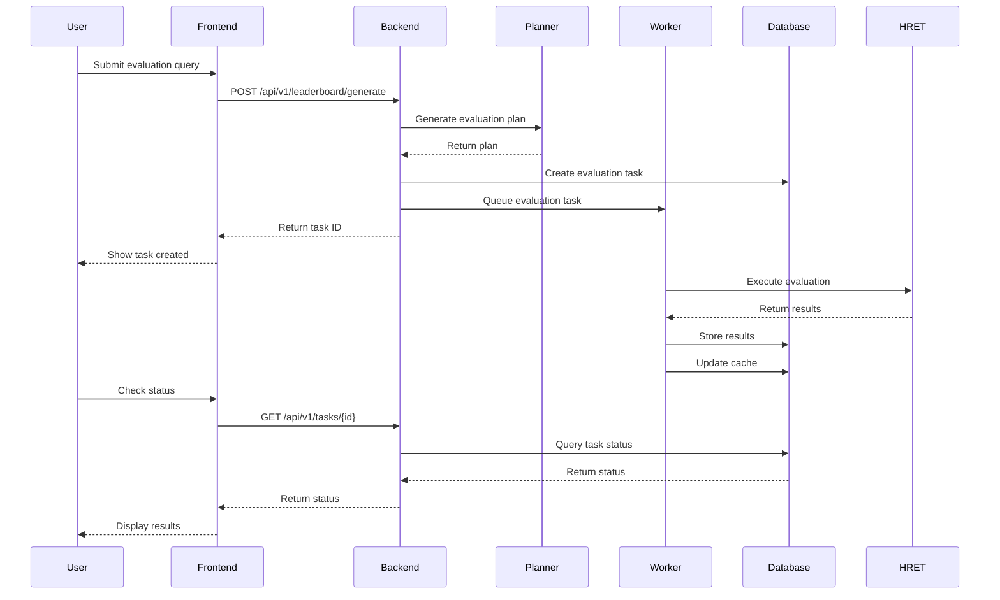

# System Architecture

This document provides a comprehensive overview of BenchHub Plus architecture, design decisions, and system components.

## 🏗️ High-Level Architecture

```
┌─────────────────────────────────────────────────────────────────┐
│                        BenchHub Plus                            │
├─────────────────────────────────────────────────────────────────┤
│                                                                 │
│  ┌─────────────┐    ┌─────────────┐    ┌─────────────┐         │
│  │  Streamlit  │    │   FastAPI   │    │   Celery    │         │
│  │  Frontend   │◄──►│   Backend   │◄──►│   Workers   │         │
│  └─────────────┘    └─────────────┘    └─────────────┘         │
│         │                   │                   │               │
│         │                   ▼                   ▼               │
│         │          ┌─────────────┐    ┌─────────────┐           │
│         │          │ PostgreSQL  │    │    Redis    │           │
│         │          │  Database   │    │    Cache    │           │
│         └──────────┤             │    └─────────────┘           │
│                    └─────────────┘                              │
│                           │                                     │
│                  ┌─────────────┐                                │
│                  │ HRET Toolkit│                                │
│                  │ Integration │                                │
│                  └─────────────┘                                │
└─────────────────────────────────────────────────────────────────┘
```

## 🧩 Component Architecture

### Frontend Layer (Reflex)

**Purpose**: User interface and interaction layer

**Components**:
- `rxconfig.py`: Frontend/backed port configuration and plugins
- `reflex_frontend/reflex_frontend.py`: Application entry point and state
- `reflex_frontend/`: UI components and layout helpers
- `assets/`: Static assets and stylesheets

**Responsibilities**:
- User input collection and validation
- Real-time data visualization
- API communication with the FastAPI backend
- Session state management via Reflex state

**Technology Stack**:
- Reflex for the web interface
- Tailwind CSS plugin for styling
- httpx for API communication

### Backend Layer (FastAPI)

**Purpose**: REST API and business logic layer

**Components**:
- `main.py`: FastAPI application setup
- `routers/`: API endpoint definitions
- `services/`: Business logic layer
- `repositories/`: Data access layer

**Architecture Pattern**: Repository-Service Pattern

```
┌─────────────┐    ┌─────────────┐    ┌─────────────┐
│   Router    │───►│   Service   │───►│ Repository  │
│ (API Layer) │    │ (Business)  │    │ (Data)      │
└─────────────┘    └─────────────┘    └─────────────┘
```

**Responsibilities**:
- API endpoint handling
- Request/response validation
- Business logic orchestration
- Database operations
- Task queue management

### Worker Layer (Celery)

**Purpose**: Asynchronous task processing

**Components**:
- `celery_app.py`: Celery configuration
- `tasks/`: Task definitions
- `hret_runner.py`: HRET toolkit integration
- `evaluation_engine.py`: Evaluation logic

**Task Types**:
- Evaluation tasks
- Data processing tasks
- Cache management tasks
- Cleanup tasks

**Responsibilities**:
- Background task execution
- Model API integration
- Evaluation processing
- Result aggregation

### Data Layer

#### PostgreSQL Database

**Purpose**: Persistent data storage

**Schema Design**:
```sql
-- Core tables
leaderboard_cache     -- Cached evaluation results
evaluation_tasks      -- Task tracking and metadata
experiment_samples    -- Individual evaluation samples

-- Indexes for performance
idx_model_score       -- (model_name, score)
idx_language_subject  -- (language, subject_type)
idx_task_status       -- (status, created_at)
```

#### Redis Cache

**Purpose**: Temporary data and task queue

**Usage**:
- Celery task queue
- Session storage
- Temporary result caching
- Rate limiting data

## 🔄 Data Flow Architecture

### Evaluation Request Flow

```
1. User Input (Frontend)
   ↓
2. API Request (Backend)
   ↓
3. Plan Generation (Planner Agent)
   ↓
4. Task Creation (Database)
   ↓
5. Queue Task (Celery)
   ↓
6. Process Evaluation (Worker)
   ↓
7. Store Results (Database)
   ↓
8. Update Cache (Redis)
   ↓
9. Display Results (Frontend)
```

### Detailed Flow Diagram



## 🧠 AI/ML Architecture

### Planner Agent

**Purpose**: Convert natural language queries to structured evaluation plans

**Architecture**:
```
Natural Language Query
        ↓
   Prompt Engineering
        ↓
    LLM Processing (OpenAI)
        ↓
   Response Parsing
        ↓
  Structured Plan (YAML)
```

**Components**:
- Query analysis
- Context extraction
- Plan generation
- Validation and refinement

### Evaluation Engine

**Purpose**: Execute evaluations and calculate metrics

**Architecture**:
```
Evaluation Plan
        ↓
   Sample Generation
        ↓
   Model Execution
        ↓
   Response Collection
        ↓
   Metric Calculation
        ↓
   Result Aggregation
```

**Metrics Supported**:
- Accuracy
- F1 Score
- Precision/Recall
- Semantic Similarity
- Custom Metrics

## 🔐 Security Architecture

### Authentication & Authorization

**Current State**: API Key based authentication for external services
**Future**: User authentication and role-based access control

### Data Security

**Encryption**:
- API keys encrypted at rest
- HTTPS for all communications
- Database connection encryption

**Access Control**:
- Environment-based configuration
- Principle of least privilege
- Secure defaults

### Input Validation

**Layers**:
1. Frontend validation (Streamlit)
2. API validation (Pydantic)
3. Database constraints (SQLAlchemy)

## 📊 Performance Architecture

### Scalability Design

**Horizontal Scaling**:
- Multiple worker instances
- Load balancing support
- Database connection pooling

**Vertical Scaling**:
- Resource optimization
- Efficient algorithms
- Caching strategies

### Caching Strategy

**Multi-Level Caching**:
```
1. Application Cache (Redis)
   ├── Task results
   ├── Leaderboard data
   └── Session data

2. Database Cache (PostgreSQL)
   ├── Query result cache
   └── Connection pooling

3. HTTP Cache (Browser)
   ├── Static assets
   └── API responses
```

### Performance Monitoring

**Metrics Tracked**:
- Request latency
- Task processing time
- Database query performance
- Memory usage
- Error rates

## 🔄 Deployment Architecture

### Development Environment

```
Docker Compose (Local)
├── Frontend Container (Streamlit)
├── Backend Container (FastAPI)
├── Worker Container (Celery)
├── Database Container (PostgreSQL)
└── Cache Container (Redis)
```

### Production Environment

```
Kubernetes/Docker Swarm
├── Load Balancer (Nginx)
├── Frontend Pods (Multiple instances)
├── Backend Pods (Multiple instances)
├── Worker Pods (Auto-scaling)
├── Database (Managed service)
└── Cache (Managed service)
```

### CI/CD Pipeline

```
Code Push → GitHub Actions → Tests → Build → Deploy
    ↓           ↓            ↓       ↓       ↓
  Trigger   Unit Tests   Docker   Registry  K8s
           Integration   Images   Push      Update
           E2E Tests
```

## 🔌 Integration Architecture

### External Services

**Model APIs**:
- OpenAI API
- Anthropic API
- Hugging Face API
- Custom model endpoints

**HRET Toolkit**:
- Evaluation framework
- Dataset management
- Metric calculations

### API Design

**RESTful Principles**:
- Resource-based URLs
- HTTP methods for operations
- Status codes for responses
- JSON for data exchange

**API Versioning**:
- URL-based versioning (`/api/v1/`)
- Backward compatibility
- Deprecation strategy

## 📈 Monitoring Architecture

### Application Monitoring

**Metrics Collection**:
- Prometheus metrics
- Custom application metrics
- Performance counters

**Logging Strategy**:
- Structured logging (JSON)
- Log levels (DEBUG, INFO, WARN, ERROR)
- Centralized log aggregation

### Health Checks

**Multi-Level Health Checks**:
```
1. Service Health
   ├── Database connectivity
   ├── Redis connectivity
   └── External API availability

2. Application Health
   ├── Memory usage
   ├── CPU usage
   └── Disk space

3. Business Logic Health
   ├── Task queue status
   ├── Worker availability
   └── Evaluation success rate
```

## 🔮 Future Architecture Considerations

### Planned Enhancements

**Microservices Evolution**:
- Service decomposition
- API gateway
- Service mesh

**Advanced AI Features**:
- Multi-modal evaluations
- Custom model training
- Automated benchmark generation

**Enterprise Features**:
- Multi-tenancy
- Advanced security
- Audit logging

### Scalability Roadmap

**Phase 1**: Current architecture (Single deployment)
**Phase 2**: Horizontal scaling (Multiple instances)
**Phase 3**: Microservices (Service decomposition)
**Phase 4**: Cloud-native (Serverless components)

## 🛠️ Development Architecture

### Code Organization

**Modular Design**:
```
apps/
├── core/          # Shared components
├── backend/       # API layer
├── frontend/      # UI layer
├── worker/        # Task processing
└── planner/       # AI planning
```

**Dependency Management**:
- Clear separation of concerns
- Minimal coupling
- Dependency injection

### Testing Architecture

**Test Pyramid**:
```
    E2E Tests (Few)
       ↑
  Integration Tests (Some)
       ↑
   Unit Tests (Many)
```

**Test Types**:
- Unit tests for individual components
- Integration tests for API endpoints
- End-to-end tests for complete flows

## 📋 Architecture Decisions

### Key Design Decisions

1. **Microservices vs Monolith**: Started with modular monolith for simplicity
2. **Database Choice**: PostgreSQL for ACID compliance and JSON support
3. **Task Queue**: Celery for mature ecosystem and reliability
4. **Frontend Framework**: Streamlit for rapid development
5. **API Framework**: FastAPI for performance and automatic documentation

### Trade-offs Made

**Simplicity vs Scalability**: Chose simplicity for initial implementation
**Performance vs Development Speed**: Prioritized development speed
**Flexibility vs Consistency**: Balanced with clear interfaces

---

*This architecture document is living and will be updated as the system evolves. For questions about architectural decisions or proposals for improvements, please open a discussion in our GitHub repository.*
